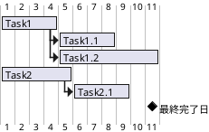
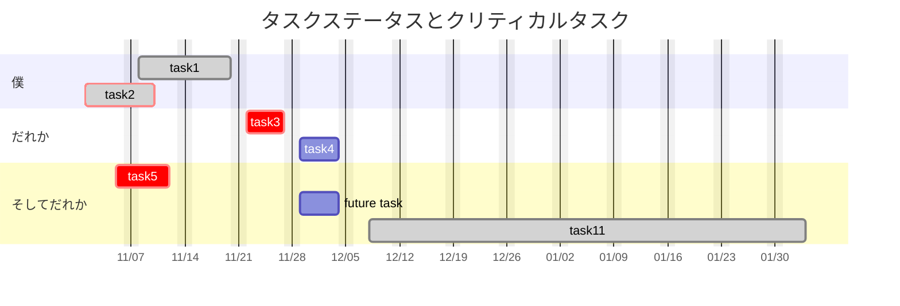

# テスト

```plantuml
@startgantt
[Task1] lasts 4 days
then [Task1.1] lasts 4 days
[Task1.2] starts at [Task1]'s end and lasts 7 days

[Task2] lasts 5 days
then [Task2.1] lasts 4 days

[最終完了日] happens at [Task1.1]'s end
[最終完了日] happens at [Task1.2]'s end
[最終完了日] happens at [Task2.1]'s end
@endgantt
```

```mermaid
gantt
title タスクステータスとクリティカルタスク
dateFormat YYYY/MM/DD
axisFormat %m/%d
excludes weekends

section 僕
task1:       done,         2021/11/08, 2021/11/18
task2: crit, done,   tes2, 2021/11/01, 7d
section だれか
task3: crit,         tes3, 2021/11/22, 5d
task4:                     2021/11/29, 5d
section そしてだれか
task5: crit,               2021/11/05, 5d
future task:               after tes3 tes1, 5d
task11:      done,   tes1, 2021/12/08, 2022/01/18
```